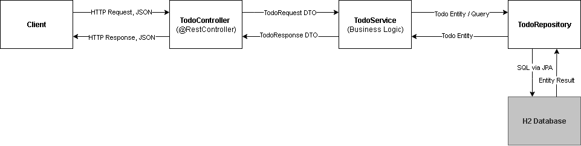

# Todo Service

Java 21 • Spring Boot 3.5 • REST API • JPA/H2 • JUnit • Swagger/OpenAPI

A simple microservice for managing **Todos**.\
It serves as a **demo project** for REST APIs, JPA/Hibernate, DTOs,
validation, Swagger documentation, and H2 database usage.



------------------------------------------------------------------------

## Features

-   **REST API** with CRUD operations (`/api/v1/todos`)
-   **Spring Data JPA** for database access
-   **H2** (in-memory or file-based) as database
-   **DTOs** (`TodoRequest`, `TodoResponse`) for clear separation
-   **Swagger UI** for interactive API exploration
-   **JUnit tests** for service and controller layer
-   **Dockerfile** for containerization


## How to Run

### 1. Local with Maven

``` bash
.\mvnw spring-boot:run
```

## API Docs
- Swagger UI: http://localhost:8080/swagger-ui/index.html
- OpenAPI JSON: http://localhost:8080/v3/api-docs

### 2. As JAR

``` bash
./mvnw clean package -DskipTests
java -jar target/todo-service-0.0.1-SNAPSHOT.jar
```

### 3. With Docker

``` bash
docker build -t todo-service .
docker run -p 8080:8080 todo-service
```

------------------------------------------------------------------------

## API Endpoints

### Get all todos

``` bash
GET /api/v1/todos
```

### Create a todo

``` bash
POST /api/v1/todos
Content-Type: application/json

{
  "title": "Shopping list",
  "description": "Milk, bread, eggs",
  "done": false
}
```

### Update a todo

``` bash
PUT /api/v1/todos/{id}
```

### Delete a todo

``` bash
DELETE /api/v1/todos/{id}
```

------------------------------------------------------------------------

## Database (H2)

### In-Memory (default)

-   URL: `jdbc:h2:mem:todos;DB_CLOSE_DELAY=-1;MODE=PostgreSQL`
-   User: `sa`
-   Password: *(empty)*

### File-based (persistent)

``` yaml
spring:
  datasource:
    url: jdbc:h2:file:./data/todos;DB_CLOSE_DELAY=-1;MODE=PostgreSQL
    username: sa
    password:
```

### H2 Console
http://localhost:8080/h2-console

- JDBC URL: (as configured above)
- User: sa
- Password: (empty)

SQL example:

``` sql
SELECT * FROM TODO;
```

------------------------------------------------------------------------

## Tests

Run unit and integration tests:

``` bash
.\mvnw test
```

------------------------------------------------------------------------

## CI/CD

-   GitHub Actions workflows (`.github/workflows/ci.yml`, `docker.yml`)
-   Automated build & test
-   Optional: Docker build & push

------------------------------------------------------------------------

## Example Flows

This section illustrates how data flows through the layers (DTOs → Entity → Database → DTOs) for common operations.


### 🟢 GET /todos

**1. Client Request**

```http
GET /api/v1/todos
```

**2. Database (H2)**

Table `TODO` contains:

| ID | TITLE          | DESCRIPTION          | DONE   |
|----|----------------|----------------------|-----------|
| 1  | Shopping list  | Milk, bread, eggs    | false     |
| 2  | Homework       | Math exercises       | true      |

**3. Service → Response DTO**

```java
List<TodoResponse> = [
  { id=1, title="Shopping list", description="Milk, bread, eggs", done=false },
  { id=2, title="Homework", description="Math exercises", done=true }
]
```

**4. Client Response (JSON)**

```json
[
  {
    "id": 1,
    "title": "Shopping list",
    "description": "Milk, bread, eggs",
    "done": false
  },
  {
    "id": 2,
    "title": "Homework",
    "description": "Math exercises",
    "done": true
  }
]
```

---

### 🟡 POST /todos

**1. Client Request (JSON → TodoRequest DTO)**

```http
POST /api/v1/todos
Content-Type: application/json

{
  "title": "Shopping list",
  "description": "Milk, bread, eggs",
  "done": false
}
```

Mapped to:

```java
TodoRequest {
  title = "Shopping list"
  description = "Milk, bread, eggs"
  done = false
}
```

**2. Service → Entity**

```java
Todo {
  id = null // auto-generated
  title = "Shopping list"
  description = "Milk, bread, eggs"
  done = false
}
```

**3. Database (H2)**

Row inserted into `TODO`:

| ID | TITLE          | DESCRIPTION          | DONE   |
|----|----------------|----------------------|-----------|
| 1  | Shopping list  | Milk, bread, eggs    | false     |

**4. Response (Entity → TodoResponse DTO → JSON)**

```json
{
  "id": 1,
  "title": "Shopping list",
  "description": "Milk, bread, eggs",
  "done": false
}
```

---

### 🔵 PUT /todos/{id}

**1. Client Request (Update todo with id=1)**

```http
PUT /api/v1/todos/1
Content-Type: application/json

{
  "title": "Shopping list",
  "description": "Milk, bread, eggs, butter",
  "done": true
}
```

Mapped to:

```java
TodoRequest {
  title = "Shopping list"
  description = "Milk, bread, eggs, butter"
  done = true
}
```

**2. Service → Update Entity**

```java
Todo {
  id = 1
  title = "Shopping list"
  description = "Milk, bread, eggs, butter"
  done = true
}
```

**3. Database (H2)**

Row updated in `TODO`:

| ID | TITLE          | DESCRIPTION                | DONE   |
|----|----------------|----------------------------|-----------|
| 1  | Shopping list  | Milk, bread, eggs, butter  | true      |

**4. Response (TodoResponse DTO → JSON)**

```json
{
  "id": 1,
  "title": "Shopping list",
  "description": "Milk, bread, eggs, butter",
  "done": true
}
```
