# 📋 Todo Service

> **Modern Full-Stack Todo Management Platform**

    

Todo management system with cross-platform support. Features modern web and mobile interfaces powered by Spring Boot backend, showcasing clean architecture and containerized deployment.

---

## 🏗️ System Architecture

```mermaid
graph TB
    subgraph "Client Applications"
        WEB[🌐 React Web App<br/>localhost:3000]
        MOBILE[📱 Expo Mobile App<br/>React Native]
    end
    
    subgraph "Backend Services"
        API[🔗 REST API<br/>Spring Boot 3.5.4<br/>localhost:8080]
        SWAGGER[📚 API Documentation<br/>/swagger-ui]
    end
    
    subgraph "Data Layer"
        H2[(💾 H2 Database<br/>Embedded)]
    end
    
    subgraph "Infrastructure"
        DOCKER[🐳 Docker Container<br/>Production Ready]
    end
    
    WEB --> API
    MOBILE --> API
    API --> H2
    API -.-> SWAGGER
    DOCKER -.-> API
    
    classDef frontend fill:#e3f2fd,stroke:#1976d2
    classDef backend fill:#e8f5e8,stroke:#388e3c
    classDef database fill:#fff3e0,stroke:#f57c00
    classDef infrastructure fill:#fce4ec,stroke:#c2185b
    
    class WEB,MOBILE frontend
    class API,SWAGGER backend
    class H2 database
    class DOCKER infrastructure
```



---

## 🚀 Quick Start Guide

### **🔧 Backend Development**
```bash
# Start Spring Boot application
./mvnw spring-boot:run

# Access points:
# 🌐 API: http://localhost:8080
# 📚 Docs: http://localhost:8080/swagger-ui
```

### **💻 Web Frontend**
```bash
# Setup and start React application
cd frontend
npm install
npm run dev

# 🌐 Web App: http://localhost:3000
```

### **📱 Mobile App**
```bash
# Setup and start Expo application
cd mobile-expo
npm install
npm start

# 📱 Scan QR code with Expo Go app
```

### **🐳 Production Deployment**
```bash
# Build and run Docker container
docker build -t todo-service .
docker run -p 8080:8080 todo-service

# 🌐 Production: http://localhost:8080
```

---

## 🛠️ Technology Stack

```mermaid
graph LR
    subgraph "Frontend Ecosystem 🎨"
        REACT[React 19.1<br/>Modern UI]
        VITE[Vite 7.0<br/>Build Tool]
        EXPO[Expo 54.0<br/>Mobile Framework]
        RN[React Native<br/>Cross-Platform]
    end
    
    subgraph "Backend Ecosystem ⚙️"
        JAVA[Java 21<br/>Runtime]
        SPRING[Spring Boot 3.5.4<br/>Framework]
        MAVEN[Maven 3.9.11<br/>Build Tool]
    end
    
    subgraph "Infrastructure 🏗️"
        H2[(H2 Database<br/>Embedded)]
        DOCKER[🐳 Docker<br/>Containerization]
    end
    
    REACT -.->|REST API| SPRING
    EXPO -.->|REST API| SPRING
    SPRING --> H2
    
    classDef frontend fill:#4fc3f7,color:#000,stroke:#0277bd
    classDef backend fill:#81c784,color:#000,stroke:#388e3c
    classDef infrastructure fill:#ffb74d,color:#000,stroke:#f57c00
    
    class REACT,VITE,EXPO,RN frontend
    class JAVA,SPRING,MAVEN backend
    class H2,DOCKER infrastructure
```



### **Detailed Stack Overview**

| 🏷️ **Layer** | 🔧 **Technology** | 📝 **Purpose** | 🔗 **Version** |
|---------------|-------------------|----------------|----------------|
| **Backend API** | Spring Boot | REST API & Business Logic | 3.5.4 |
| **Runtime** | Java | Application Runtime | 21 |
| **Database** | H2 Database | Embedded Data Storage | Latest |
| **Web Frontend** | React + Vite | Modern Single Page Application | 19.1 + 7.0 |
| **Mobile App** | Expo + React Native | Cross-Platform Mobile | 54.0 |
| **Build Tools** | Maven | Dependency Management | 3.9.11 |
| **Deployment** | Docker | Containerized Production | Latest |


## 🔗 API Endpoints

| Method | Endpoint | Description |
|--------|----------|-------------|
| `GET` | `/api/todos` | Fetch all todos |
| `POST` | `/api/todos` | Create new todo |
| `PUT` | `/api/todos/{id}` | Update existing todo |
| `DELETE` | `/api/todos/{id}` | Delete todo |

📚 **Full API Documentation**: [http://localhost:8080/swagger-ui](http://localhost:8080/swagger-ui)

---

## 📄 License

MIT License - see [LICENSE](LICENSE) file for details.

---

**👨‍💻 Author**: [Ali Ünal](https://github.com/Ali-Uen)

---
